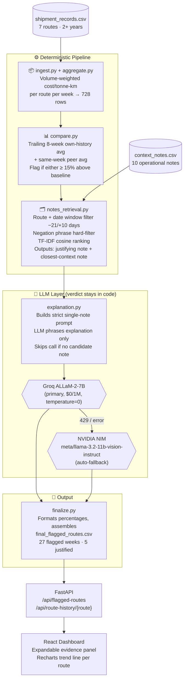
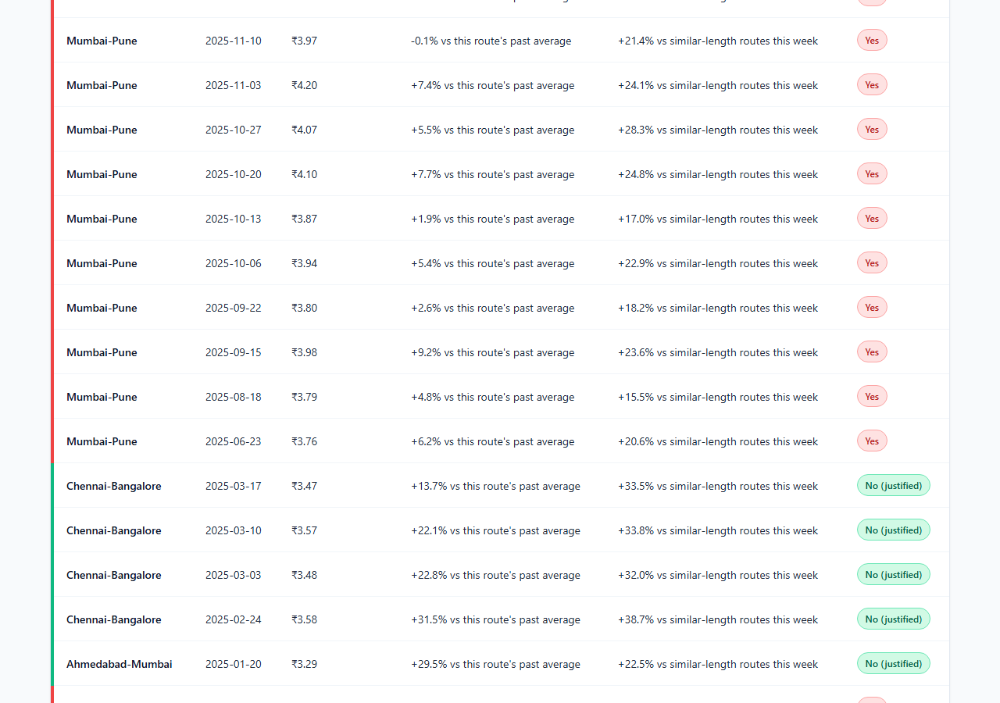
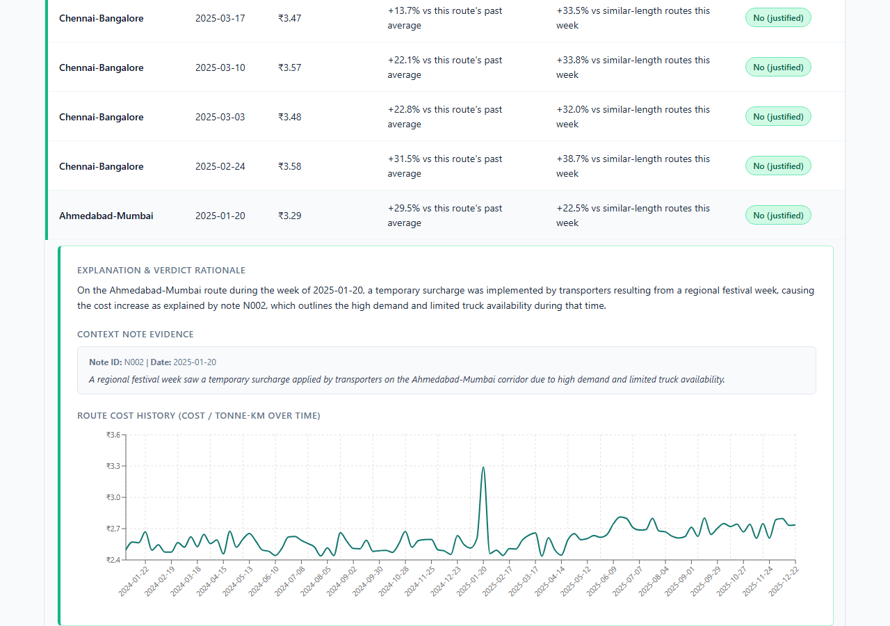
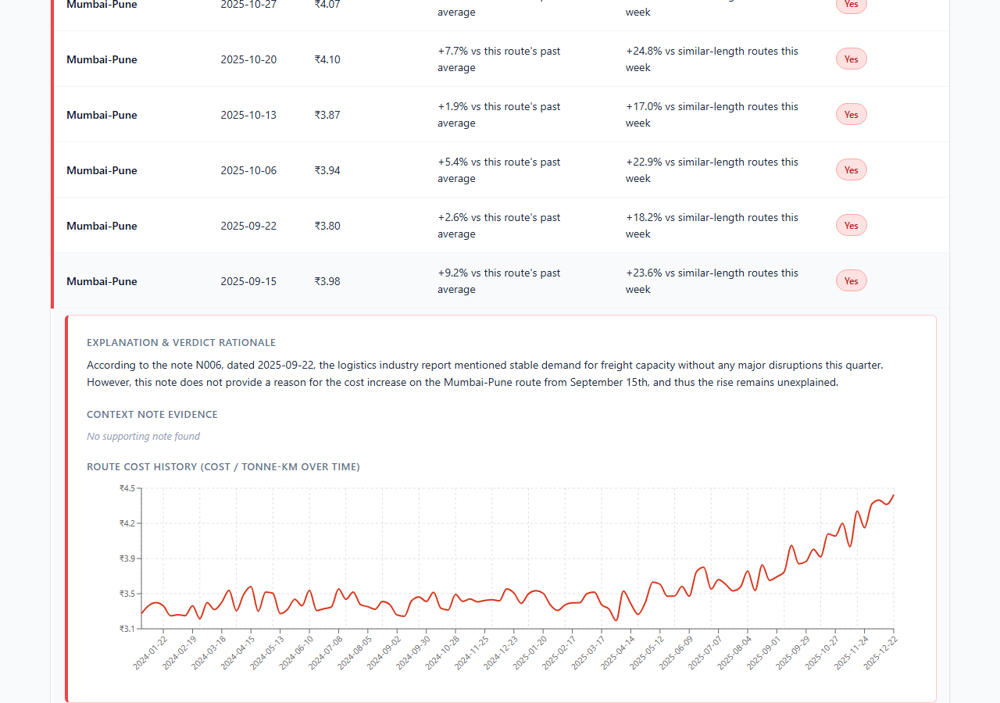
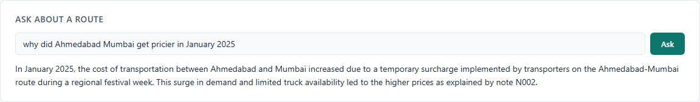
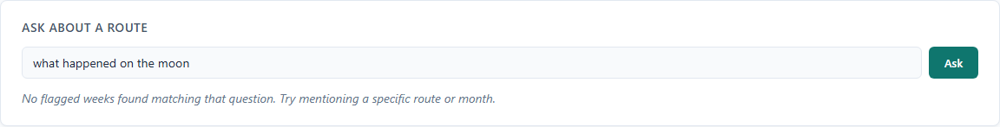

<div align="center">

# 🚚 FreightTiger Cost Watch

**Automated freight anomaly detection with LLM-grounded explanations and a live analytics dashboard**

[](https://python.org)
[](https://fastapi.tiangolo.com)
[](https://react.dev)
[](https://groq.com)
[](#reproducibility)

</div>

---

## What it does

FreightTiger Cost Watch ingests weekly shipment records, detects cost-per-tonne-km spikes per route, cross-references them against a structured notes dataset to find real-world justifications (floods, festivals, diesel price hikes), and generates a single grounded explanation per flagged week using an LLM — without ever letting the LLM decide the verdict.

The output is a read-only FastAPI backend + React dashboard where a reviewer can inspect every anomaly, read its matched evidence note, and trace the full route cost trend in one click.

---

## High-Level Architecture



---

## Key Engineering Decisions

| Decision | What & Why |
|---|---|
| **Aggregate then divide** | Sum route-level cost and tonne-km before dividing, not average per-shipment ratios. Prevents small shipments from distorting the weekly metric. |
| **15% anomaly threshold** | Calibrated against all three worked examples in the brief — separates signal from noise without false positives on normal week-to-week variance. |
| **−21 / +10 day note window** | Captures advance announcements (diesel price warnings) and multi-week disruptions (floods) without pulling in unrelated historical context. |
| **Two-bucket note split** | Justifying vs. closest-context. Allows the LLM to name a nearby-but-rejected note in its explanation — matching the brief's own worked examples. |
| **TF-IDF, not neural embeddings** | 10 notes doesn't warrant a vector database or a download. TF-IDF is deterministic, offline, and fast — exactly right at this scale. |
| **LLM for phrasing only** | Verdict logic lives entirely in Python. The LLM prompt is locked to a single note and cannot override the flag. Reproducibility is guaranteed. |
| **Groq → NVIDIA NIM fallback** | Two same-shape OpenAI-compatible providers. If Groq rate-limits mid-run, NVIDIA NIM takes over transparently — verified by disabling the primary key. |

---

## Pipeline Stages

```
backend/pipeline/
├── ingest.py           load_shipments()  →  typed DataFrame
├── aggregate.py        weekly_aggregate()  →  output/weekly_aggregates.csv  (728 rows)
├── compare.py          add_own_history(), add_peer_comparison(), flag_anomalies()
│                       →  output/flagged_weeks.csv  (27 flagged)
├── notes_retrieval.py  load_notes(), is_negated(), rank_by_similarity()
│                       →  output/candidate_matches.csv
├── explanation.py      build_prompt(), get_verdict_and_reason()
│                       →  output/explained_weeks.csv + output/llm_usage_log.csv
└── finalize.py         format_pct(), build_output_row()
                        →  output/final_flagged_routes.csv  (hand-in artifact)
```

- `backend/qa.py` + `POST /api/ask`: answers plain-English questions about a specific route by filtering already-computed output and phrasing one grounded LLM response — the stretch-goal Q&A feature.

---

## Screenshots

### Dashboard Overview



The full flagged-routes table, with unexplained (red) and justified (green) verdicts visually distinguished.

### Evidence Panel — Justified



Expanding a justified row shows the matched note text, date, and grounded explanation alongside the route's cost trend.

### Evidence Panel — Unexplained



Expanding an unexplained row shows the closest available note was checked and correctly rejected, rather than silently ignored.

### Ask About a Route (Stretch Goal)





The Q&A feature answers grounded questions from already-verified data, and gives a clear no-match response for unrecognized routes rather than guessing.

---

## Quickstart

```bash
# 1. Install dependencies
pip install pandas scikit-learn requests python-dotenv fastapi uvicorn

# 2. Configure backend/.env
GROQ_API_KEY=your_groq_key
GROQ_MODEL=allam-2-7b
NVIDIA_API_KEY=your_nvidia_key
NVIDIA_NIM_MODEL=meta/llama-3.2-11b-vision-instruct

# 3. Run the pipeline
python backend/pipeline/aggregate.py
python backend/pipeline/compare.py
python backend/pipeline/notes_retrieval.py
python backend/pipeline/explanation.py
python backend/pipeline/finalize.py

# 4. Start the backend:
python backend/api.py  # (this occupies the terminal — leave it running)

# In a new, separate terminal, start the frontend:
cd frontend && npm install && npm run dev  # → http://localhost:5173
```

---

## Dashboard

The React dashboard (`frontend/src/App.jsx`) provides:

- **27-row anomaly table** sorted by week descending, with red/green verdict badges
- **Expandable evidence panel** per row — reason text, matched note ID + date + full text
- **Route cost trend chart** (Recharts LineChart) fetched on first expand, cached client-side
- **One-source-of-truth design** — the API serves precomputed CSVs, no recomputation on request

---

## Reproducibility

```
reproducibility_check.py runs the full pipeline three times end-to-end
and diffs every graded column (route, week_of, cost_per_tonne_km,
vs_own_history, vs_similar_routes, flagged, matched_note_id).

Result: REPRODUCIBLE  ✓  (3/3 passes, see reproducibility_result.txt)
```

All LLM calls use `temperature=0`. All verdicts and numbers are computed in code, never by the LLM.

---

## Token & Cost Accounting

| Metric | Value |
|---|---|
| LLM calls | 14 |
| Input tokens | 2,188 |
| Output tokens | 1,185 |
| Provider | Groq (ALLaM-2-7B) |
| Cost | **$0.00** (free tier) |

---

## Evaluation

`backend/pipeline/eval_harness.py` runs two independent checks:

1. **4 labeled cases** — hand-verified across all four verdict scenarios (peer-justified, history-justified, note rejected, no note at all)
2. **Full-dataset negation safety scan** — re-reads raw note text for every `matched_note_id` in final output; confirms zero negated notes slipped through

```
PASS: Ahmedabad-Mumbai (2025-01-20)
PASS: Chennai-Bangalore (2025-02-24)
PASS: Mumbai-Pune (2025-09-15)
PASS: Delhi-Jaipur (2024-11-11)
5/5 matched notes passed negation safety check
EVAL PASSED
```

---

## Project Structure

```
freighttiger-cost-watch/
├── backend/
│   ├── api.py                     FastAPI app (3 endpoints, read-only + Q&A)
│   ├── qa.py                      Route extraction, dataframe filtering, prompt building
│   └── pipeline/
│       ├── ingest.py
│       ├── aggregate.py
│       ├── compare.py
│       ├── notes_retrieval.py
│       ├── explanation.py
│       ├── finalize.py
│       ├── llm_provider.py        LLMProvider ABC + GroqProvider + NvidiaNimProvider + FallbackProvider
│       └── eval_harness.py
├── frontend/
│   └── src/
│       ├── App.jsx                Dashboard component
│       └── App.css
├── data/
│   ├── shipment_records.csv
│   ├── context_notes.csv
│   └── sample_output_format_v2.csv
├── output/                        All pipeline artifacts (gitignored: none)
├── reproducibility_check.py
├── reproducibility_result.txt     ← hand-in artifact
└── decisions.md                   Full decision log across all 8 sections
```

---

## Known Limitations

- Thresholds tuned on 7 routes and 10 notes — a larger dataset may require recalibration
- Date window is a heuristic offset, not parsed from note prose
- Eval harness covers 4 labeled cases; not exhaustive across the full anomaly space

---

<div align="center">
<sub>Built end-to-end as a take-home assignment · decisions.md documents every design judgment call</sub>
</div>
